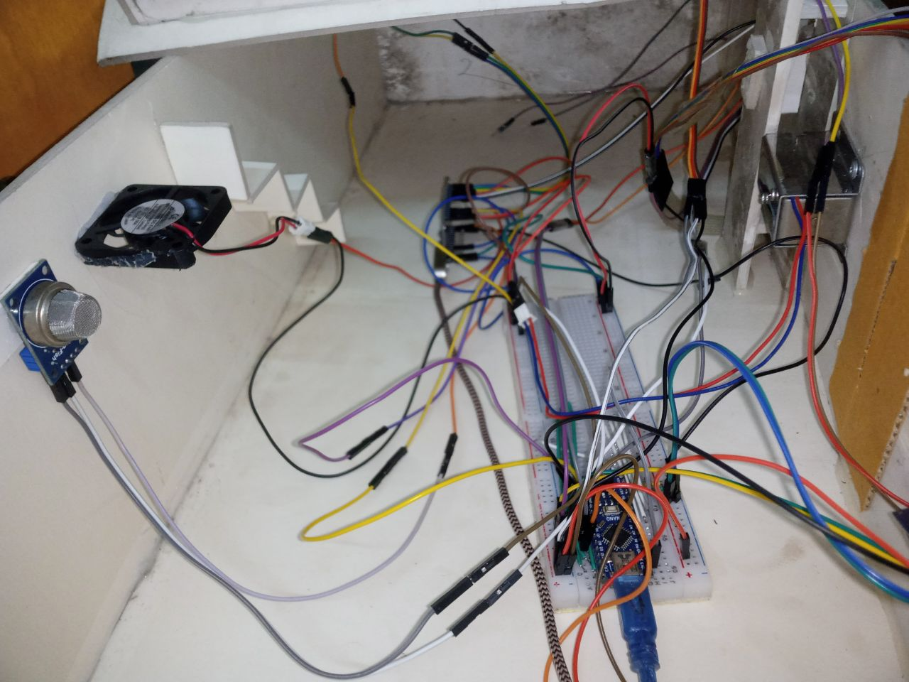

# SmartHomeAutomationProject

## Overview

SmartHomeAutomationProject is an embedded system project designed to automate and monitor home functions using microcontrollers and sensors. It leverages ESP32-CAM and Arduino platforms, providing features such as camera streaming, remote access, keypad-based security, and sensor-driven event handling for smart home applications.

---

### System Images




---

## Main Components

### 1. ESP32-CAM Module
- **Camera Streaming**: The ESP32Cam folder contains code to initialize and manage the camera module (`ESP32Cam.ino`, `app_httpd.cpp`).
- **HTTP Server**: The camera stream and control endpoints are exposed via an HTTP server (`app_httpd.cpp`).
- **Face Detection**: Implements human face detection algorithms (e.g., `HumanFaceDetectMSR01`, `HumanFaceDetectMNP01`).
- **WiFi & Blynk Integration**: Connects to WiFi and Blynk cloud for IoT functionality.
- **LED Flash Control**: Allows remote activation of LED flash on the camera.

### 2. Arduino Security & Sensor Control
- **Keypad Security**: Implements keypad logic to unlock doors and activate security features (`arduino.ino.ino`).
- **Buzzer Alerts**: Buzzer routines for various alerts, such as gas detection and unauthorized access.
- **Sensor Integration**: Handles input from IR, ultrasonic, and gas sensors, triggering tones and security actions.

### 3. Web Interface
- **camera_index.h**: Contains compressed HTML resources for web-based control and monitoring of the camera module.

---

## Usage

### ESP32-CAM Setup
1. Flash the ESP32Cam.ino sketch to your ESP32-CAM board.
2. Edit the WiFi credentials in ESP32Cam.ino:
   ```cpp
   const char *ssid = "YOUR_SSID";
   const char *password = "YOUR_WIFI_PASSWORD";
   ```
3. Set up your Blynk Auth Token in ESP32Cam.ino:
   ```cpp
   #define BLYNK_AUTH_TOKEN "YOUR_BLYNK_TOKEN"
   ```
4. Power the ESP32-CAM board and access the camera stream via the configured HTTP endpoint.

### Arduino Security System
1. Flash `arduino.ino.ino` to your Arduino-compatible microcontroller.
2. Connect keypad, buzzer, IR, ultrasonic, and gas sensors as per your hardware setup.
3. The microcontroller will handle security logic and sensor alerts automatically.

---

## Features

- Real-time camera streaming.
- Remote LED flash and camera control via web and Blynk.
- Keypad-based electronic lock management.
- Alert system for gas leaks, intrusion, and wrong access attempts.
- Modular architecture for easy extension with new sensors or actuators.

---

## License

This project is licensed under the MIT License. See the [LICENSE](LICENSE) file for details.

---

## Contribution

Feel free to fork the repository and submit pull requests. For major changes, please open an issue first to discuss what you would like to change.

---

## Author

Shefat Al Mahmud
